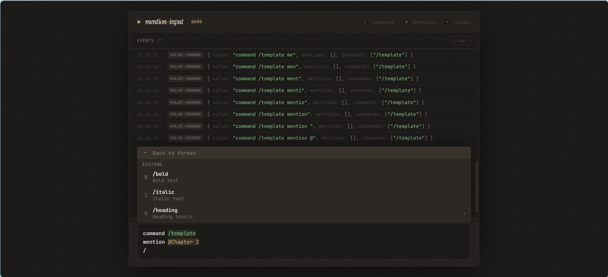

# mention-input

English | [中文](./README.zh-CN.md)

<p align="center">
  <a href="https://github.com/jinlif/mention-input/releases">
    
  </a>
  <a href="https://www.npmjs.com/package/mention-input">
    
  </a>
  <a href="https://github.com/jinlif/mention-input/blob/main/LICENSE">
    
  </a>
  <br />
</p>

A framework-agnostic, extensible input component with `@` mentions and `/` slash commands. Built as a native Web Component with [Lit](https://lit.dev/), it works seamlessly in React, Vue, Svelte, or plain HTML.

**[Live Demo](https://jinlif.github.io/mention-input/)**

<p align="center">
  
</p>

## Features

- **@ Mentions** — type `@` to trigger a searchable suggestion panel with grouped and nested items
- **/ Slash Commands** — type `/` to browse commands with support for nested sub-commands
- **Nested Navigation** — drill into categories with arrow keys; items with children are navigable but not selectable
- **Command Actions** — three built-in action types: `execute` (fire and forget), `fill` (insert a template with `{cursor}` caret placement), `modal` (notify host app to open a dialog)
- **Auto-resize Textarea** — grows from `minRows` to `maxRows` as content increases
- **Highlight Layer** — selected @mentions and /commands are visually highlighted inline as you type
- **Rich Event System** — `submit`, `valuechange`, `mentionselect`, `commandselect` events with structured detail objects
- **Full CSS Customization** — 20+ CSS custom properties for colors, fonts, spacing, shadows, and more
- **Keyboard Driven** — arrow keys navigate suggestions, Enter selects, Escape dismisses, Shift+Enter for newline
- **Zero Framework Lock-in** — native Web Component; works everywhere the browser runs

## Installation

```bash
npm install mention-input
```

## Quick Start

```html
<script type="module">
  import 'mention-input';
</script>

<mention-input placeholder="Type @ to mention or / for commands..."></mention-input>
```

## Usage

### Plain HTML

```html
<!DOCTYPE html>
<html>
<head>
  <script type="module">
    import 'mention-input';
  </script>
</head>
<body>
  <mention-input id="input" placeholder="Write something..."></mention-input>

  <script>
    const el = document.getElementById('input');

    el.mentionSources = {
      items: [
        { id: '1', label: 'Alice', group: 'Users', icon: 'A' },
        { id: '2', label: 'Bob', group: 'Users', icon: 'B' },
      ],
      groupOrder: ['Users'],
    };

    el.commands = [
      { name: 'help', category: 'system', description: 'Show help', action: 'execute' },
      { name: 'template', category: 'writing', description: 'Insert template', action: 'fill', prompt: 'Write about {cursor}' },
    ];

    el.addEventListener('submit', (e) => {
      console.log('Value:', e.detail.value);
      console.log('Mentions:', e.detail.mentions);
      console.log('Commands:', e.detail.commands);
      el.reset();
    });
  </script>
</body>
</html>
```

### React

```tsx
import { useRef, useCallback } from 'react';
import 'mention-input';

// Type declaration for the custom element
declare global {
  namespace JSX {
    interface IntrinsicElements {
      'mention-input': React.DetailedHTMLProps<React.HTMLAttributes<HTMLElement>, HTMLElement> & {
        placeholder?: string;
        disabled?: boolean;
        value?: string;
        mentionSources?: MentionSource;
        commands?: Command[];
      };
    }
  }
}

export function ChatInput() {
  const ref = useRef<HTMLElement>(null);

  const mentionSources: MentionSource = {
    items: [
      { id: '1', label: 'John Doe', group: 'Users', icon: 'J' },
      { id: '2', label: 'Jane Smith', group: 'Users', icon: 'S' },
    ],
    groupOrder: ['Users'],
  };

  const commands: Command[] = [
    { name: 'clear', category: 'system', description: 'Clear conversation', action: 'execute' },
  ];

  const onSubmit = useCallback((e: CustomEvent) => {
    console.log(e.detail.value, e.detail.mentions);
    (ref.current as any)?.reset();
  }, []);

  return (
    <mention-input
      ref={ref}
      placeholder="Type a message..."
      mentionSources={mentionSources}
      commands={commands}
      // @ts-expect-error — custom element event
      onSubmit={onSubmit}
    />
  );
}
```

### Vue

```vue
<template>
  <mention-input
    ref="inputRef"
    placeholder="Type a message..."
    :mentionSources.prop="mentionSources"
    :commands.prop="commands"
    @submit="onSubmit"
  />
</template>

<script setup>
import { ref } from 'vue';
import 'mention-input';

const inputRef = ref(null);

const mentionSources = {
  items: [
    { id: '1', label: 'Alice', group: 'Users', icon: 'A' },
    { id: '2', label: 'Bob', group: 'Users', icon: 'B' },
  ],
  groupOrder: ['Users'],
};

const commands = [
  { name: 'help', category: 'system', description: 'Show help', action: 'execute' },
];

function onSubmit(e) {
  console.log(e.detail.value, e.detail.mentions);
  inputRef.value?.reset();
}
</script>
```

## Data Model

### Mentions

```ts
interface MentionSource {
  items: MentionItem[];
  filter?: (query: string, items: MentionItem[]) => MentionItem[];
  groupOrder?: string[];
}

interface MentionItem {
  id: string;
  label: string;
  description?: string;
  group?: string;
  icon?: string;
  data?: unknown;
  children?: MentionItem[];
}
```

### Commands

```ts
interface Command {
  name: string;
  category: string;
  description: string;
  icon?: string;
  action?: 'execute' | 'fill' | 'modal';
  prompt?: string;       // for 'fill': template with {cursor} caret placement
  modalName?: string;    // for 'modal': identifier for host app
  children?: Command[];
}
```

## Events

| Event | Detail | Description |
|---|---|---|
| `submit` | `{ value, mentions, commands }` | Fired on Enter (without Shift). Includes the full text and all selected mentions/commands. |
| `valuechange` | `{ value, mentions, commands }` | Fired on every input change. Mentions/commands are auto-cleaned when their text is deleted. |
| `mentionselect` | `{ item }` | Fired when a mention is selected from the suggestion panel. |
| `commandselect` | `{ command }` | Fired when a command is selected from the suggestion panel. |
| `reset` | — | Fired when `reset()` is called. |

## Public API

| Method | Description |
|---|---|
| `reset()` | Clears value, suggestions, highlights, and dispatches a `reset` event. |
| `clear()` | Clears value and all selected items without dispatching a `reset` event. |
| `focus()` | Focuses the internal textarea. |

## CSS Custom Properties

Customize the component appearance with CSS custom properties:

```css
mention-input {
  --mi-font-family: inherit;
  --mi-font-size: 14px;
  --mi-line-height: 1.5;
  --mi-bg: #fff;
  --mi-border: #e2e8f0;
  --mi-border-focus: #3b82f6;
  --mi-text: #1a202c;
  --mi-text-muted: #718096;
  --mi-text-placeholder: #a0aec0;
  --mi-caret-color: #3b82f6;
  --mi-highlight-bg: rgba(59, 130, 246, 0.15);
  --mi-highlight-color: #3b82f6;
  --mi-cmd-highlight-bg: rgba(16, 185, 129, 0.15);
  --mi-cmd-highlight-color: #10b981;
  --mi-panel-bg: #fff;
  --mi-panel-border: #e2e8f0;
  --mi-panel-shadow: 0 -4px 16px rgba(0, 0, 0, 0.08);
  --mi-selected-bg: rgba(59, 130, 246, 0.08);
  --mi-scrollbar-thumb: #cbd5e0;
  --mi-scrollbar-thumb-hover: #a0aec0;
  --mi-radius: 6px;
  --mi-padding: 8px 12px;
}
```

## Slots & Parts

The internal textarea is exposed via the `textarea` CSS part for additional styling:

```css
mention-input::part(textarea) {
  /* Direct styling of the textarea element */
}
```

## License

MIT
